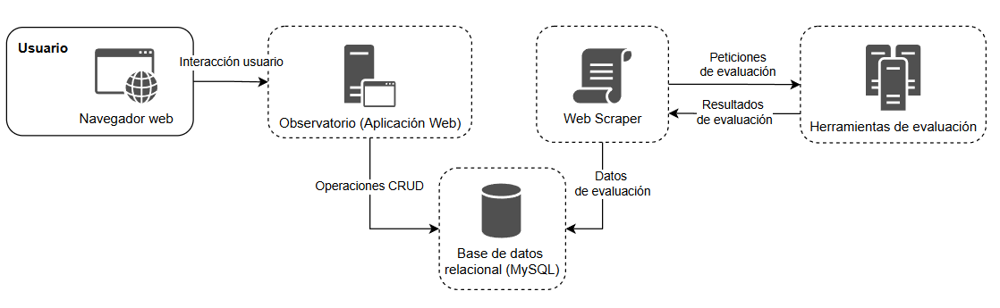

# Desarrollo de un observatorio para el seguimiento de la accesibilidad web

## Descripción

Este proyecto consiste en el desarrollo de un observatorio para la evaluación y seguimiento de la accesibilidad web. Está enfocado en asegurar que las instituciones públicas y ciertas empresas privadas cumplan con la legislación vigente sobre accesibilidad en sus servicios en línea.

## Motivación

El principal motivo de este proyecto es evidenciar las barreras de accesibilidad en la web que enfrentan las personas con discapacidad. Además, se alinea con la normativa de la Unión Europea de 2018, que obliga a los estados miembros a realizar un seguimiento del nivel de accesibilidad de los sitios web y aplicaciones móviles de las administraciones públicas.

## Objetivos

### Objetivo principal

Crear un observatorio que permita evaluar y monitorear la accesibilidad de los sitios web obligados por ley a ser accesibles.

### Objetivos específicos

- Presentar datos sobre problemas y advertencias de accesibilidad de cada institución.
- Generar informes sobre el grado de accesibilidad de los portales web.
- Incorporar diversas herramientas de evaluación en línea.
- Ofrecer distintas periodicidades para el seguimiento y evaluación.
- Categorizar los portales web por categorías organizacionales, de modo que facilite el estudio de accesibilidad dependiendo de estas categorías.
- Tener una administración completa y sencilla de los sitios, herramientas y páginas, que facilite los procesos de administración del observatorio.

## Herramientas utilizadas

- **Git**: control de versiones del código.
- **GitHub**: repositorio del proyecto.
- **Trello**: gestión del proyecto y seguimiento de tareas.
- **Python y Crontab**: automatización de tareas y web scraping.
- **MySQL**: sistema de gestión de bases de datos utilizado para almacenar la información recopilada.
- **Laravel**: framework de PHP utilizado para el desarrollo del back-end de la aplicación web.
- **Bootstrap**: framework de front-end para desarrollar una aplicación web responsiva.
- **Google Developers Charts**: visualización de datos de la aplicación web.

## Arquitectura del sistema

## Fases del proyecto

1. **Análisis y especificación de requisitos**: Definición de los requisitos funcionales y no funcionales.
2. **Selección de herramientas de evaluación**: Elección de las herramientas para recopilar datos de análisis de accesibilidad web.
3. **Diseño**: Diseño del almacenamiento de datos, arquitectura conceptual y tecnológica, y creación de mockups.
4. **Implementación**:
   - Creación de la base de datos.
   - Obtención de datos de las herramientas de evaluación mediante web scraping.
   - Desarrollo de la aplicación web.

## Evaluación de la accesibilidad web

El seguimiento se ha realizado sobre una muestra de veinticinco sitios web, evaluando diez páginas por sitio con seis herramientas diferentes, generando informes semanales durante dos meses.

- **AccessMonitor**
- **AChecker**
- **European Internet Inclusion Initiative Page Checker**
- **Observatorio de Accesibilidad Web de la Universidad Politécnica Salesiana de Ecuador**
- **Vamolà**
- **WAVE**

## Archivos de la parte de web scraping

En este proyecto se ha hecho uso de web scraping para obtener los datos de evaluación de algunas de las herramientas. Antes de utilizar dichos archivos, recomiendo consultar las políticas de uso de los sitios web y contactar a los administradores para obtener el permiso necesario.

**Descargo de responsabilidad:** este repositorio es únicamente con fines educativos y de demostración. El scraping de contenido de los sitios web puede estar en contra de sus Términos de Servicio (TOS). Por favor, consulta los TOS del sitio correspondiente antes de utilizar cualquier archivo obtenido mediante web scraping. No me hago responsable de cualquier consecuencia derivada del mal uso del código de este proyecto. No tengo ninguna afiliación con los sitios web mencionados en este proyecto.

---

Autor: Jesús Fernando Guijarro Sendra  
Tutor: Sergio Luján Mora  
Enero 2019
